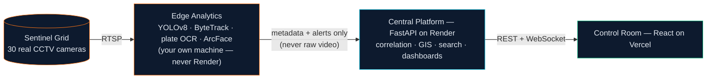
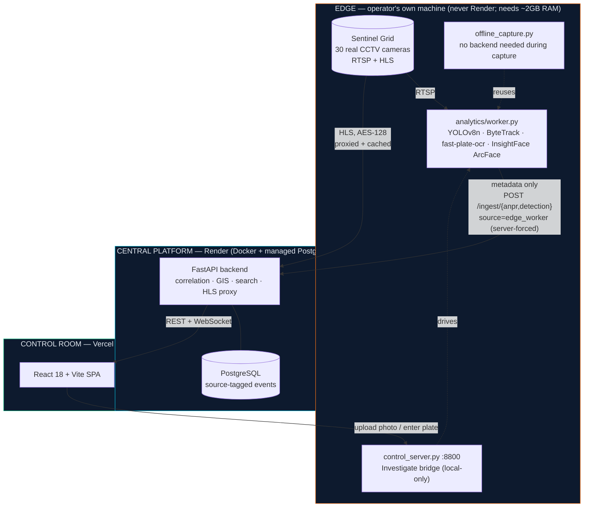

<div align="center">

# Gujarat IVMS

**Integrated Video Management & Analytics Platform**
*Gujarat Police hackathon build · hybrid architecture (Model 1 + 2 + 3 + selective 4)*

[](https://github.com/vaibhav700c/guj-ivms/actions/workflows/ci.yml)
[](LICENSE)
[](backend/requirements.txt)
[](backend)
[](frontend)
[](#tech-stack)

[**Live Demo**](https://guj-ivms.vercel.app) · [**API Docs**](https://guj-ivms-api.onrender.com/docs) · [Architecture](#architecture) · [Quick Start](#quick-start) · [What's Real](#whats-real-and-how-thats-actually-enforced)

</div>

---



Raw video never leaves the edge. Only structured metadata — plate strings, bounding
boxes, confidences, face embeddings — reaches the central platform. That's what makes
an 80,000-camera target bandwidth-plausible, and it's the one rule every code path here
follows: never ship frames to the backend.

The full spec is `plan.md` at the repo root — deliberately gitignored, along with
`integration_camera.txt` (live camera-grid credentials), because this repository is
public. If either is missing from your checkout, ask for it rather than guessing; this
README and `docs/` describe what's actually built, which is the reliable source for
current behavior.

## Contents

- [What's Real, and How That's Actually Enforced](#whats-real-and-how-thats-actually-enforced)
- [Capability Matrix](#capability-matrix)
- [Architecture](#architecture)
- [Quick Start](#quick-start)
- [The Real CV Pipeline](#the-real-cv-pipeline)
- [Investigate](#investigate--wanted-person-photo-search--live-plate-watch)
- [Deployment](#cloud-deployment-already-wired)
- [API Surface](#api-surface-v1)
- [Traps That Have Already Cost Real Debugging Time](#traps-that-have-already-cost-real-debugging-time)
- [Tech Stack](#tech-stack)
- [Deliverables](#deliverables)

## What's Real, and How That's Actually Enforced

Every event this platform stores carries a `source` field: `"edge_worker"` for a
genuine detection from the real CV pipeline, `"simulator"` for the bundled demo
generator. This isn't a cosmetic label — it's enforced at write time (the ingest API
hardcodes it server-side; a POST body can never spoof it), it's filterable on every
list endpoint (`?source=edge_worker`), and the frontend's **"Real detections only"**
toggle in the top bar — **on by default** — hides everything else. A simulated row that
does slip through a filtered view still can't pass as real: it carries a visible
`SIMULATED` badge everywhere it appears.

The demo simulator itself defaults to **off** (`SIMULATOR_AUTO_START=false`), and a
second guard refuses to auto-start it at all when `ENVIRONMENT=production`, even if
that variable drifts back to `true` on the hosting platform — this was a real
production incident during development (see `git log --grep=simulator`), not a
hypothetical.

This matters because it's the actual failure mode this project fought hardest: a
hackathon demo is trivial to fake with a random-data generator, and a fake result
that's indistinguishable from a real one is worse than an honest "not implemented."
Nothing in this README claims a capability that wasn't independently verified against
the real Sentinel Grid feeds.

## Capability Matrix

| Capability | Status | Evidence |
|---|---|---|
| Live HLS video, 30 real Sentinel cameras | ✅ Real | AES-128 decrypted client-side; `docs/HLD.md` §4 |
| YOLOv8 person/vehicle/face detection | ✅ Real | Bounding box baked into the evidence JPEG by OpenCV, not a CSS overlay |
| License-plate OCR | ✅ Real, on 9/30 cameras | `GJ11T5967`, cam06 — corroborated: bus lettered "Amrut Institute Junagadh," GJ-11 *is* the Junagadh RTO code |
| ANPR on the other 21 cameras | ⚠️ Confirmed impossible | Human-reviewed frame-by-frame: glare/distance/motion blur/B&W — skipped, not hallucinated |
| Cross-camera vehicle re-ID | ✅ Real | HSV appearance histogram, for cameras where plates can't be read |
| Face re-identification (ArcFace) | ✅ Real, probabilistic | Cosine similarity measured 0.39–0.49 same-person vs 0.08–0.10 different-person |
| GIS journey reconstruction | ✅ Real | Coordinates joined from the real camera registry, never fabricated |
| Per-camera capability verification | ✅ Real | Isolated automated run per camera; see Camera Registry → any camera |
| 30-camera concurrent throughput | ⚠️ Measured limit | 5–14× frame-rate drop under full parallelism on one machine — a real hardware ceiling |
| Event provenance (`source` field) | ✅ Enforced server-side | Client can never set it; see above |

## Architecture

**Hybrid — Model 1 (Registry+GIS) + Model 2 (Unified Viewing) + Model 3 (Federation
Ingest) + selective Model 4 (centralized analytics/alerts).**



The edge/central split isn't incidental — Render's free tier (512MB RAM, 0.1 CPU)
cannot run YOLOv8 + InsightFace + plate OCR, which need roughly 2GB RAM under load.
Running the real CV stack on the operator's own machine is what makes "analytics at
the edge" literally true rather than a slide.

**Full detail — component table, the real detection→alert sequence diagram, and the
deployment topology diagram — lives in [`docs/HLD.md`](docs/HLD.md)**, kept there
rather than duplicated here so there's exactly one place to update.

## Quick Start

```bash
# Backend (SQLite fallback — no Postgres needed)
cd backend
python -m venv .venv && .venv/bin/pip install -r requirements.txt pytest
.venv/bin/uvicorn app.main:app --port 8000
# Auto-seeds: 30 real Sentinel Grid cameras (real coordinates), watchlist, VAHAN
# records, users. Simulator is OFF by default — the dashboard starts empty until
# a real edge worker ingests events, or you deliberately POST /api/v1/simulator/start.

.venv/bin/python -m pytest tests/ -v   # 24 tests, isolated SQLite, simulator disabled

# Frontend
cd frontend
npm install && npm run dev        # http://localhost:5173
npx tsc --noEmit && npm run build  # both must pass before committing
```

Login: `admin` / `admin123` (or just visit — `REQUIRE_AUTH=false` auto-authenticates).

> **First load of any route is slow in dev mode** (a few seconds) — that's Vite
> compiling that route's modules on demand, a one-time cost per file per dev-server
> session, not a network or backend problem. `npm run build && npm run preview` skips
> it entirely (confirmed under 2s cold in both modes) and is what's actually deployed
> to Vercel.

## The Real CV Pipeline

```bash
cd analytics
python -m venv .venv && .venv/bin/pip install -r requirements.txt   # pulls torch, insightface (~330MB first run)
export SENTINEL_EMAIL=... SENTINEL_PASSWORD=...   # both required — see Traps below

# Sanity check the video source with zero ML involved
.venv/bin/python worker.py test-rtsp --camera 6 --out /tmp/f.jpg

# The always-on edge worker (posts to a running backend)
timeout 150 .venv/bin/python worker.py run        # ALWAYS bound it; loops forever

# The Investigate page's on-demand bridge — upload a photo or enter a plate,
# pick cameras, watch real detections happen (needs the backend running)
.venv/bin/uvicorn control_server:app --port 8800

# Verify one camera's real capability in isolation, no CPU contention with
# anything else — records a CameraCapabilityRun the UI can show
.venv/bin/python run_capability_audit.py --cameras 4,6,12

# Capture against many cameras with NEITHER the backend nor control_server
# running — durable local SQLite instead, true concurrent capture safe since
# there's no live UI to protect from CPU contention. Replay it in afterward:
.venv/bin/python offline_capture.py --cameras all --duration 300 --parallel
.venv/bin/python replay_offline_capture.py   # once the backend is back up
```

See [`docs/ANALYTICS.md`](docs/ANALYTICS.md) for the model stack, degradation
behavior, and per-camera capability config.

## Investigate — wanted-person photo search & live plate watch

The real CV stack (YOLOv8 + InsightFace ArcFace + plate OCR, ~2GB RAM) never runs on
Render's 512MB free tier — it runs on your own machine, driving the same
`analytics/` worker code the always-on edge pipeline uses. Open the **Investigate**
page (works against the deployed site too — `localhost:8800` fetches from an HTTPS
page aren't blocked as mixed content since `localhost` is a spec'd trustworthy origin),
upload a reference photo or enter a plate, pick real cameras, and start monitoring.
The page shows the actual live camera footage plus a live-updating strip of real
annotated detection frames while it runs — not a status line, actual video and actual
evidence images. Matches raise real alerts (camera, timestamp, confidence, the real
detection frame) on **Live Alerts** and the **GIS Map**.

## Full Stack (Postgres + PostGIS + Redis + MinIO + MediaMTX)

```bash
docker compose up --build
```

## Cloud Deployment (already wired)

| Component | URL |
|---|---|
| Control Room UI (Vercel) | **https://guj-ivms.vercel.app** |
| Backend API (Render) | **https://guj-ivms-api.onrender.com** |
| Swagger docs | https://guj-ivms-api.onrender.com/docs |
| WebSocket live alerts | wss://guj-ivms-api.onrender.com/ws/alerts |

Both platforms auto-deploy on push to `master`. First boot auto-seeds the 30 real
Sentinel Grid cameras, watchlist, VAHAN records, and users.

> **Deploying this yourself:** apply `render.yaml` as a Render **Blueprint**, not a
> hand-created service — otherwise none of its environment variables reach the
> container and the API silently falls back to an ephemeral SQLite file wiped on every
> restart. `SENTINEL_EMAIL` **and** `SENTINEL_PASSWORD` are both required — the grid's
> sign-in form rejects a password-only POST with an HTTP 200 and no cookie, so a naive
> status check reads that as success. Setting env vars on Render does **not** itself
> trigger a redeploy.

## API Surface (v1)

```
POST /api/v1/auth/login                 GET  /api/v1/auth/me
GET/POST/PATCH/DELETE /api/v1/cameras   GET  /api/v1/cameras/{id}/capability-runs
GET/POST/PATCH/DELETE /api/v1/watchlist
GET  /api/v1/alerts                     PATCH /api/v1/alerts/{id}/status
GET  /api/v1/analytics/overview         GET  /api/v1/analytics/events?source=edge_worker
GET  /api/v1/vehicles/search/{plate}    GET  /api/v1/vehicles/journey/{plate}
GET  /api/v1/vehicles/traffic/*         GET  /api/v1/reports/*.csv
POST /api/v1/ingest/anpr                POST /api/v1/ingest/detection
GET  /api/v1/simulator/status           POST /api/v1/simulator/{start,stop}
WS   /ws/alerts                         GET  /health
```

Interactive docs: `/docs` (Swagger UI). Full reference: [`docs/API.md`](docs/API.md).

## Traps That Have Already Cost Real Debugging Time

- **`SENTINEL_EMAIL` and `SENTINEL_PASSWORD` are both required**, everywhere the
  Sentinel Grid is touched (HLS proxy, RTSP worker, control_server). Missing either
  silently 503s every live-video/snapshot/detection path.
- **RTSP uses HTTP Basic auth** — percent-encode credentials into the URL userinfo.
- **The plate OCR model is single-channel** — a 3-channel BGR crop fails ONNX shape
  validation on the channel axis and silently disables ANPR.
- **The upstream CDN is Cloudflare-fronted and rate-limits by source IP.** Do not
  load-test it. The backend proxies every viewer through one address; playlists and
  segments are cached, concurrent identical fetches are coalesced, and a background
  warmer keeps the default live-grid cameras pre-fetched so a normal page load never
  pays the upstream's own ~4-25 KB/s cold-fetch cost.
- **A threshold expressed in raw sample count silently changes meaning if the sample
  rate changes** — caught live when raising the CV worker's FPS cut a static-background
  filter's effective grace period in half. Anything gating on "N occurrences in a
  window" should gate on real elapsed time instead.
- **Python's `threading.Thread` reserves a private `_stop()` method** — naming your own
  instance attribute `self._stop` silently shadows it and only crashes inside
  `Thread.join()`, which may not be called on every code path that uses the thread.
- Full list, including Render/Postgres-specific traps: see `CLAUDE.md`.

## Tech Stack

<div align="center">

| Layer | Technologies |
|---|---|
| **Backend** | FastAPI · SQLAlchemy 2 · PostgreSQL (+PostGIS/TimescaleDB) · Redis · SQLite (dev) |
| **Frontend** | React 18 · Vite · TypeScript · Tailwind CSS · Leaflet + OpenStreetMap · Recharts |
| **Computer Vision** | YOLOv8 (ultralytics) · ByteTrack (supervision) · fast-plate-ocr · InsightFace (buffalo_l / ArcFace) |
| **Realtime** | WebSocket · Redis pub/sub |
| **Infra** | Docker Compose · MediaMTX · MinIO · Render · Vercel |

**All free and open-source — zero licensing cost, zero vendor lock-in.**

</div>

## Deliverables

- **HLD** — [docs/HLD.md](docs/HLD.md) *(architecture, data-flow, and deployment diagrams)*
- **Analytics pipeline** — [docs/ANALYTICS.md](docs/ANALYTICS.md)
- **Demo script** — [docs/DEMO_SCRIPT.md](docs/DEMO_SCRIPT.md)
- **Deployment guide** — [docs/DEPLOYMENT.md](docs/DEPLOYMENT.md)
- **API reference** — [docs/API.md](docs/API.md) · live Swagger at `/docs`
- **Security architecture** — [docs/SECURITY.md](docs/SECURITY.md)
- **Solution presentation** — [docs/PRESENTATION.pdf](docs/PRESENTATION.pdf)
  (regenerate: `python docs/generate_presentation.py`)
