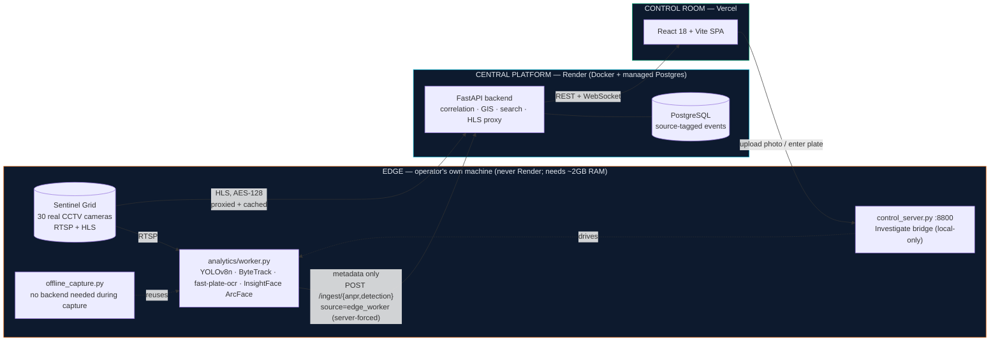
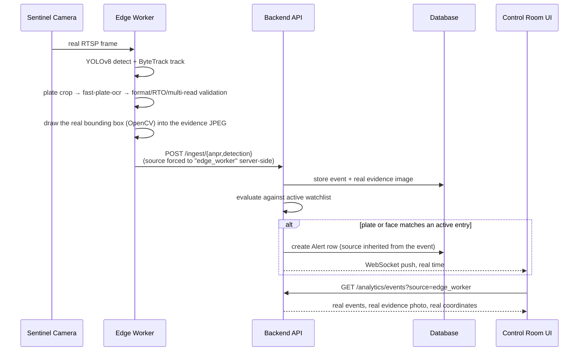
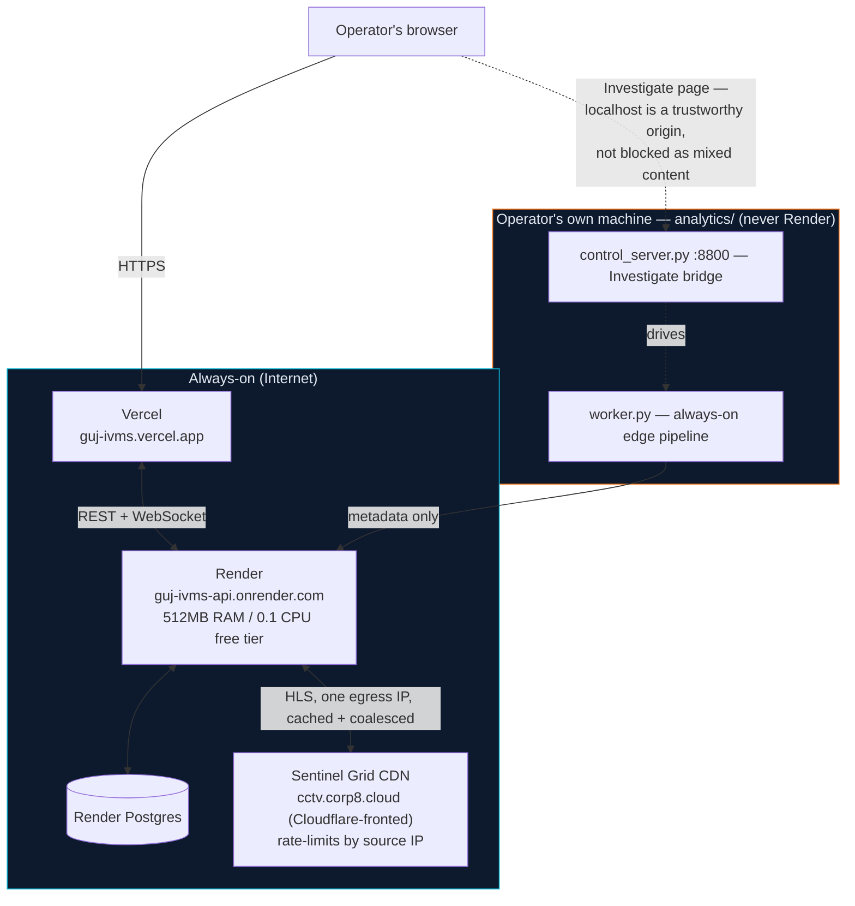

# Gujarat IVMS — High-Level Design

> Companion to `plan.md`. Describes the implemented system end-to-end — what's
> actually running, not the aspirational version. Diagrams render natively on
> GitHub/GitLab (Mermaid); if your viewer doesn't render them, the fenced
> source is still readable as plain text.

## 1. Architectural Model

**Hybrid — Model 1 (Registry+GIS) + Model 2 (Unified Viewing) + Model 3 (Federation
Ingest) + selective Model 4 (centralized analytics/alerts).**

Raw video never crosses the edge→central boundary — only plate strings, bounding
boxes, confidences and face embeddings do. That's the ≈99% bandwidth reduction the
80,000-camera target depends on, and it's enforced by construction: the ingest API has
no request field for a video frame, only metadata + a small evidence JPEG.

## 2. Components

| Component | Tech | Responsibility |
|---|---|---|
| API Gateway | FastAPI + uvicorn | REST `/api/v1/*`, JWT+RBAC, CORS, per-IP rate limiting |
| Data layer | SQLAlchemy 2 · SQLite (dev) / PostgreSQL (prod) | Cameras, watchlist, ANPR/detection events, alerts, users, health log, VAHAN-like registry, `CameraCapabilityRun` |
| **Event provenance** | `source` column, every event table | `"edge_worker"` vs `"simulator"` — set server-side, never client-controlled; filterable (`?source=`) and badge-visible everywhere |
| Alert Engine | `app/alert_engine.py` | Watchlist correlation: exact + OCR-fuzzy plate match, face embedding cosine match → `Alert` rows + WS push |
| Sentinel HLS proxy | `app/routes/sentinel.py` | Authenticates once, serves a computed live sliding window (upstream is VOD-shaped), coalesces concurrent fetches, background cache-warmer for the default grid |
| Event bus | in-process asyncio + optional Redis pub/sub | `alerts:new`, `analytics:new` channels; cross-replica fan-out |
| Realtime | WebSockets `/ws/alerts`, `/ws/analytics` | Control-room live feeds |
| Federation ingest | `POST /ingest/{anpr,detection}` + `X-API-Key` | Model 3 adapter contract; the one path any real edge node — this one or a future third party's — writes through |
| Edge CV worker | `analytics/worker.py` | The real pipeline: YOLOv8n detect, ByteTrack, fast-plate-ocr with Indian-format + RTO-district validation, ArcFace re-ID. Never runs on Render. |
| Investigate bridge | `analytics/control_server.py` | Local-only FastAPI (`:8800`) the **Investigate** page drives — upload a photo or enter a plate, pick cameras, watch real detections happen |
| Offline capture | `analytics/offline_capture.py` + `replay_offline_capture.py` | Same real pipeline, no backend/control_server dependency during capture (durable local SQLite); replays into the backend afterward through the same real ingest endpoints |
| Capability verification | `analytics/run_capability_audit.py`, `CameraCapabilityRun` | An isolated, automated real run per camera, recording exactly what it found — the empirical companion to the manually-curated per-camera notes |
| Demo simulator | `app/simulator.py` | Fabricates events for a camera-less demo. **Off by default**; a second guard refuses auto-start when `ENVIRONMENT=production` regardless of the env var, after that combination produced a real incident during development |
| UI | React 18 + Vite + TS + Tailwind + Leaflet + Recharts | Control-room SPA |
| Streaming (full stack only) | MediaMTX (docker-compose) | RTSP → WebRTC/HLS conversion for the local full-stack profile |
| Object store (full stack only) | MinIO (docker-compose) | Snapshot refs (URLs stored in DB) |

## 3. Real Detection → Alert Data Flow

Other real flows follow the same shape:

- **Vehicle journey** — plate-normalized search across real ANPR events → sighting
  timeline → haversine legs (distance, elapsed time, implied speed) → GIS polyline
  replay, joined to the camera registry's real coordinates (never fabricated).
- **Cross-camera vehicle ReID** — for cameras where plate OCR is confirmed physically
  impossible (see README), an HSV appearance-histogram signature is the correlation
  signal instead, surfaced as an explicitly-labeled "probable match," never conflated
  with a confirmed plate read.
- **Camera capability verification** — `run_capability_audit.py` /
  `offline_capture.py` run the real pipeline against one camera in isolation, then
  `POST /cameras/{id}/capability-runs` records frame count, detections by type, real
  plates found, and one representative evidence photo — shown in the Camera Registry
  drawer.

## 4. Deployment Topology

The split is deliberate, not incidental: Render's free tier (512MB RAM, 0.1 CPU,
single worker) cannot run YOLOv8 + InsightFace + plate OCR — the real CV stack needs
roughly 2GB RAM and multiple cores under load. Running it on the operator's own
machine is what makes the "analytics at the edge" principle literally true rather
than a slide.

## 5. API Surface (v1)

| Group | Endpoints |
|---|---|
| auth | `POST /auth/login`, `GET /auth/me` |
| cameras | `GET/POST /cameras`, `GET /cameras/stats`, `GET /geo/nearby`, `GET /geo/coverage`, `GET /gap-analysis`, `POST /bulk`, `PATCH/DELETE /cameras/{id}`, `GET /cameras/{id}/health-log`, `GET/POST /cameras/{id}/capability-runs`, `GET /cameras/{id}/capability-runs/{run_id}/evidence`, `GET /departments/list` |
| feeds | `GET /feeds/status`, `GET /feeds/{id}/snapshot` |
| sentinel | `GET /sentinel/catalogue`, `GET /sentinel/hls/{cam}/index.m3u8`, `GET /sentinel/hls/{cam}/{segment}`, `POST /sentinel/refresh-auth` |
| departments | `GET/POST /departments`, `GET /departments/{id}` |
| watchlist | `GET/POST /watchlist`, `PATCH/DELETE /watchlist/{id}` |
| alerts | `GET /alerts`, `GET /alerts/stats`, `PATCH /alerts/{id}/status`, `GET /alerts/{id}/evidence` |
| analytics | `GET /overview`, `GET /events/timeline`, `GET /detections/by-type`, `GET /tiers/coverage`, `GET /anpr`, `GET /anpr/search`, `GET /faces`, `GET /traffic`, `GET /events?source=`, `GET /events/{id}/evidence` |
| vehicles | `GET /search/{plate}`, `GET /journey/{plate}`, `GET /last-seen/{plate}`, `GET /registry/{plate}`, `GET /recent`, `GET /traffic/by-hour`, `GET /traffic/by-camera`, `GET /events/{id}/evidence` |
| reports | `GET /reports/{alerts,anpr,cameras}.csv` |
| ingest | `POST /ingest/anpr`, `POST /ingest/detection` (X-API-Key) |
| system | `GET /health`, `GET /config`, `GET /adapters` |
| users | `GET/POST /users`, `PATCH /users/{id}` (admin) |
| simulator | `GET /status`, `POST /start`, `POST /stop` |
| ws | `/ws/alerts`, `/ws/analytics` |

## 6. Security

- PBKDF2-SHA256 (390k iterations) password hashing; JWT HS256; RBAC (admin/operator/analyst/viewer).
- `REQUIRE_AUTH=true` in strict deployments; ingest keyed via `X-API-Key`.
- Raw video never transits the API — metadata + evidence JPEGs (small, detection-time
  crops) only, never a full stream.
- Per-IP fixed-window rate limiting (300 req/60s) on the public API.

## 7. Scaling Path (→ 80,000 cameras)

- Horizontal API replicas + Redis pub/sub fan-out (configured via `REDIS_URL`).
- Regional analytics at the edge (Tier A/B/C) egressing metadata only — this session
  measured directly why that matters: 30 CV pipelines contending for one machine's
  CPU dropped real per-camera throughput 5-14×, which horizontal edge nodes avoid by
  construction rather than by tuning.
- Partitioned/time-series event tables (hypertable path in docker-compose Postgres).
- CDN-cached static frontend; MediaMTX relays per regional cluster.
